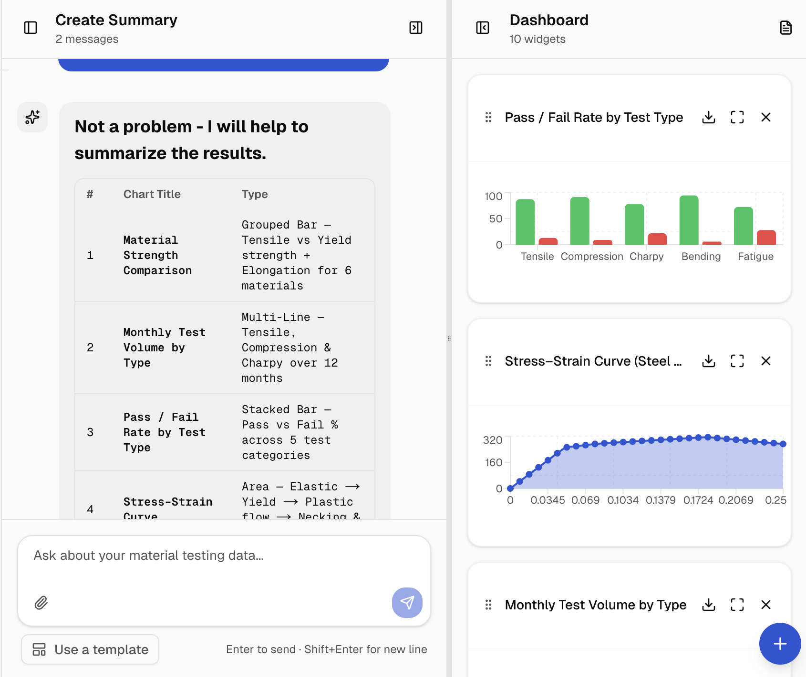
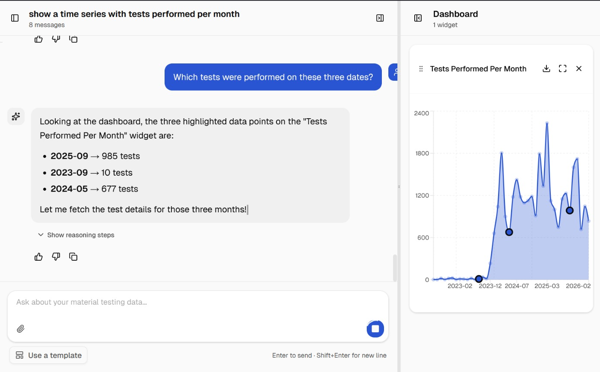

# CoMat — AI Data Analyst for Material Testing

**Your personal data analysis colleague.**

Material testing generates massive datasets — but engineers aren't data scientists. Traditional analysis takes months, requires specialized skills, and still misses domain context. CoMat changes that.

CoMat is an AI assistant that speaks the language of material testing engineers. Ask questions about your test data in plain language — get answers with charts, statistics, and follow-up suggestions. In minutes, not months.

**Live demo**: [https://test.koprolin.com/](https://test.koprolin.com/)

[](docs/1.png)
[](docs/1.png)

> *"Compare material FancyPlast 42 and UltraPlast 99 — are the differences statistically significant?"*
>
> *"Is there a trend that tensile strength is decreasing over the last 6 months?"*
>
> *"Show me all charpy impact tests performed by tester MasterOfDesaster."*

---

## Architecture

CoMat is composed of four microservices:

```
┌──────────────┐    ┌──────────────┐    ┌──────────────┐    ┌──────────────┐
│   Frontend   │◀──▶│   Backend    │◀──▶│  MCP Server  │───▶│   MongoDB    │
│  Next.js     │    │  FastAPI     │    │  MongoDB MCP │    │  (external)  │
│  :3000       │    │  :3003       │    │  :3001       │    │              │
└──────────────┘    └──────┬───────┘    └──────────────┘    └──────────────┘
                           ▲
                           |
                           ▼
                    ┌──────────────┐
                    │  RAG Service │
                    │  ChromaDB    │
                    │  :3002       │
                    └──────────────┘
```

| Service | Description | Tech |
|---------|-------------|------|
| **Frontend** | Chat UI, dashboards, and visualization rendering. Maps structured JSON responses to charts, tables, and cards. | Next.js 16, React 19, TypeScript, Tailwind CSS 4, Recharts |
| **Backend (API)** | Core orchestration — receives user queries, builds context, calls the LLM, validates generated queries, executes them, and streams structured responses via SSE. | Python 3.13, FastAPI, LangChain, Anthropic Claude API |
| **RAG Service** | Ingests domain documents (PDFs, standards) into a vector store and provides contextual retrieval for the LLM to ground its answers. | FastAPI, ChromaDB, Sentence Transformers |
| **MCP Server** | Exposes MongoDB operations (find, aggregate, count, schema inference) to the AI agent via the Model Context Protocol. | MongoDB MCP Server (Docker image) |

---

## Quick Start

### Prerequisites

- **Docker & Docker Compose** (for containerized setup)
- **Node.js 22+** and **npm** (for frontend local dev)
- **Python 3.13+** and **uv** (for backend/RAG local dev)
- An **Anthropic API key** (`ANTHROPIC_API_KEY`)

### Environment Variables

Create `.env` files before starting:

**`backend/.env`**
```env
ANTHROPIC_API_KEY=sk-ant-xxx
```

**`rag/.env`**
```env
# Add any RAG-specific config here, see .env.sample
```

---

### Option 1: Docker Compose (recommended)

Start all services with a single command:

```bash
docker compose up --build
```

This launches:
- **Frontend** at [http://localhost:3000](http://localhost:3000)
- **Backend API** at [http://localhost:3003](http://localhost:3003)
- **RAG Service** at [http://localhost:3002](http://localhost:3002)
- **MCP Server** at [http://localhost:3001](http://localhost:3001)

To stop:

```bash
docker compose down
```

---

### Option 2: Local Development (without Docker)

Run each service in a separate terminal. The MCP server still requires Docker.

#### 1. MCP Server (Docker)

```bash
docker compose up mcp
```

Wait until the health check passes (the MCP server needs to be ready before the backend starts).

#### 2. RAG Service

```bash
cd rag
uv sync
uv run uvicorn main:app --reload --port 3002
```

#### 3. Backend API

```bash
cd backend
uv sync
uvicorn backend.main:app --reload
```

> Runs on [http://localhost:8000](http://localhost:8000) by default.
> Set `MCP_URL` and `RAG_URL` environment variables if using non-default ports.

#### 4. Frontend

```bash
cd frontend
npm install
npm run dev
```

> Runs on [http://localhost:3000](http://localhost:3000).

---

## Project Structure

```
backprop-bandits-st-gallen/
├── frontend/           # Next.js chat UI & visualization layer
│   ├── src/
│   │   ├── app/        # Next.js app router pages
│   │   └── components/ # React components (chat, dashboard, charts)
│   ├── Dockerfile
│   └── package.json
├── backend/            # FastAPI orchestration & LLM engine
│   ├── routers/        # API route handlers (chat, feedback, upload)
│   ├── src/            # Agent logic, DB utilities, context building
│   ├── Dockerfile
│   └── pyproject.toml
├── rag/                # RAG service — document ingestion & retrieval
│   ├── main.py         # FastAPI endpoints (ingest, generate_context)
│   ├── retriever.py    # Vector DB retrieval logic
│   ├── ingestor.py     # PDF/document ingestion pipeline
│   ├── Dockerfile
│   └── pyproject.toml
├── mcp/                # MongoDB MCP server configuration
└── docker-compose.yml  # Full-stack orchestration
```

---

## API Overview

All routes are prefixed with `/api`.

| Method | Route | Description |
|--------|-------|-------------|
| `POST` | `/api/chat/stream` | SSE stream — natural language query to live events |
| `POST` | `/api/chat` | Non-streaming fallback |
| `GET` | `/api/sessions` | List sessions + data schema |
| `GET` | `/api/sessions/{id}` | Full session with message history |
| `PATCH` | `/api/sessions/{id}` | Rename session |
| `DELETE` | `/api/sessions/{id}` | Delete session |
| `POST` | `/api/feedback` | Submit feedback (human-in-the-loop) |
| `POST` | `/api/upload` | Upload data files |
| `GET` | `/api/templates` | List query templates |
| `POST` | `/api/templates` | Save a query template |

---

## Team

**Backprop Bandits** — built at START Hack 2026, St. Gallen.
Yannick Funke, Tianjian Yi, Paul Kling, Clemens Koprolin