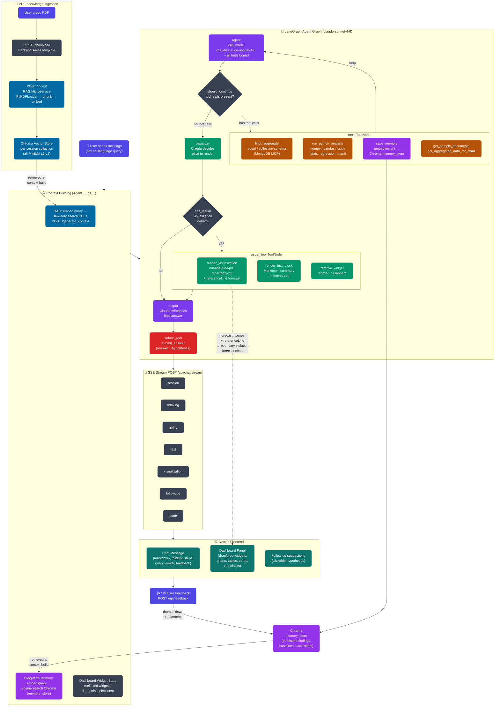

# Agent Workflow — Backprop Bandits

---

## Legend

| Colour | Component |
|---|---|
| 🟣 Indigo | User interactions |
| 🔵 Cyan | RAG / vector retrieval |
| 🟣 Purple | LLM agent nodes (Claude) |
| 🟠 Amber | Analysis & data tools |
| 🟢 Green | Visualisation layer |
| 🔴 Red | Output / answer submission |
| 🟦 Teal | Next.js frontend |
| 🟣 Violet | Long-term memory (Chroma) |

## Key flows

1. **Normal query** → Context build → Agent loop (MongoDB + Python analysis) → Visualizer → Dashboard widgets + chat answer
2. **PDF upload** → RAG microservice → session-scoped Chroma → injected as context on next query
3. **Memory write** → Agent calls `save_memory` when finding something significant → embedded → stored in `memory_store`
4. **Memory read** → Every new query embeds the user message → cosine similarity search → top matches injected into system prompt
5. **Feedback loop** → Thumbs down + comment → `save_correction()` → stored as `correction` memory → surfaces in future similar queries
6. **Predictive chart** → Agent runs linear regression → builds historical + `forecast_*` series with null gaps → `referenceLine` for spec limit → dashed forecast line rendered in frontend
